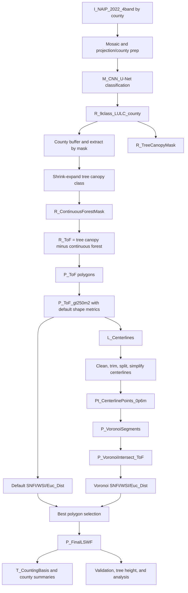

# LSWF Production Workflow

This document reconstructs the full Linear Small Woody Feature (LSWF) production
workflow represented across the repository scripts and the v17 master's thesis methods
description. It is designed to be used as the human-readable companion to
`workflow_manifest.json`.

## Scope

The workflow captures both coded and non-coded production steps:

- ArcGIS Pro/manual or external model steps that are required for the method but are not
  represented by a script in this repository.
- ArcPy script files saved with `.ipynb` extensions.
- Prototype, alternate, export, validation, and summary scripts that support provenance.

No original script is removed by this workflow layer.

## Notation

Workflow objects use short prefixes so the process can be read consistently:

| Prefix | Meaning | Example |
|---|---|---|
| `I_` | Imagery input | `I_NAIP_2022_4band` |
| `R_` | Raster layer | `R_9class_LULC_county` |
| `P_` | Polygon feature class or shapefile | `P_ToF_gt250m2` |
| `L_` | Line feature class or shapefile | `L_FinalSplitCenterlines` |
| `Pt_` | Point feature class or shapefile | `Pt_CenterlinePoints_0p6m` |
| `T_` | Table/statistical output | `T_CountySummary` |
| `M_` | Model, method, or manual process | `M_CNN_U-Net` |

Step execution types:

| Type | Meaning |
|---|---|
| `documented_external` | Required method step documented in the thesis/flowchart but not represented by repo code. |
| `arcgis_pro_manual` | ArcGIS Pro operation or model step expected to be run manually or from an ArcGIS project/tool. |
| `arcpy_script` | Scripted ArcPy step represented by one or more repo files. |
| `prototype_script` | Prototype or county-specific development script retained for provenance. |
| `export_or_transfer` | Output copy/export/value-transfer step. |
| `validation_or_analysis` | QA, validation, summary, or downstream analysis step. |

Status values used by the tracker:

| Status | Meaning |
|---|---|
| `pending` | Not yet started or not yet verified. |
| `in_progress` | Currently being run or checked. |
| `completed` | Finished and verified enough for this workflow ledger. |

## Canonical Stage Flow

## Global Parameters and Provenance Notes

| Parameter | Value/Rule | Notes |
|---|---|---|
| Source imagery | 2022 NAIP, 4-band RGB+NIR | Native resolution retained. |
| MI/WI resolution | 0.6 m | Shrink/expand appears as 30/36 cells for 60/72 ft. |
| OH resolution | 0.3 m | Shrink/expand appears as 60/72 cells for 60/72 ft. |
| Land-cover model | U-Net/CNN semantic segmentation | Upstream method step; no repo script found. |
| Tree canopy class | Class `3` in current scripts | Used for ToF isolation. |
| Initial ToF area threshold | `>= 250 m2` | Used before and after segmentation. |
| SNFI threshold | `0.8` | Used for linearity/straightness filtering. |
| Minimum Euclidean axis length | `100 m` | Used for final LSWF eligibility. |
| WSI threshold | `2.0` in current final script; `3.0` appears in thesis/flowchart notation | Needs provenance decision before treating as final canonical value. |
| Centerline negative buffer | `-1.2 m` | Used before clipping centerlines. |
| Trim distances | `30 m`, then `10 m` | Used in centerline cleanup. |
| Centerline point spacing | `0.6 m` | Used before Thiessen/Voronoi creation. |
| Line simplification tolerances | `2.5`, `5`, `7.5` m for bend detection; `0.6 m` simplification in all-county script | Used to detect split points and simplify centerlines. |

## Stage Details

### 0. Study Area and Source Inputs

Purpose: establish the complete production extent and imagery basis.

Inputs:

- `I_NAIP_2022_4band`
- 35-county study area across Michigan, Wisconsin, and Ohio
- County projection/UTM handling

Outputs:

- County imagery work units
- County code list used downstream

Repo coverage: documented in the thesis and represented indirectly by hard-coded county
lists in scripts. No standalone source-prep script is present.

### 1. Sub-Meter Land-Cover Classification

Purpose: produce county-level 9-class land-cover rasters from NAIP imagery.

Inputs:

- `I_NAIP_2022_4band`
- `M_CNN_U-Net`

Outputs:

- `R_9class_LULC_county`

Repo coverage: required external/manual ArcGIS Pro model step. A search of the repo found
no CNN inference or `ClassifyPixelsUsingDeepLearning` script.

### 2. County Clip, Buffer, and Extract

Purpose: move from all-county land-cover products into county-specific raster work units.

Primary script:

- `CountyClassificationsStage/County Extract + Buffer + Extract Raster.ipynb`

Key operations:

- Export county feature
- Buffer county by 500 meters
- Extract raster by mask

Outputs:

- `R_9class_LULC_county_clip`

### 3. Shrink-Expand Forest Mask and ToF Raster Isolation

Purpose: identify contiguous forest areas and isolate Trees Outside Forests (ToFs).

Primary scripts:

- `CountyClassificationsStage/ShrinkExpandExample VernonCounty.ipynb`
- `CountyClassificationsStage/AllCounties.ipynb`
- `CountyClassificationsStage/AllCountiesAlt.ipynb`
- `CountyClassificationsStage/JacksonMIpilot.ipynb`

Key operations:

- Shrink tree canopy class
- Expand shrunken canopy class
- Build `R_ContinuousForestMask`
- Compute `R_ToF = R_TreeCanopyMask - R_ContinuousForestMask`

Outputs:

- `R_ToF_county`
- `R_ContinuousForestMask_county`

### 4. ToF Polygonization and Default Pre-Filtering

Purpose: convert ToF rasters into polygon candidates and remove obvious non-LSWF features.

Primary scripts:

- `CountyClassificationsStage/PolygonizeToFs Huron County.ipynb`
- `CountyClassificationsStage/ShapeMetricsAutomation_v1.ipynb`
- `CountyClassificationsStage/HamiltonOHpolygonWorkaround.ipynb`

Key operations:

- Raster to polygon
- Select ToF gridcode
- Remove polygons under `250 m2`
- Add geodesic area, perimeter, extent
- Calculate Euclidean axis distance, WSI/sinuosity, SNFI, Abs_SNFI

Outputs:

- `P_ToF_gt250m2`
- `P_DefaultFilteredCandidates`

### 5. Prototype Metric and Segmentation Development

Purpose: retain Jackson County and older prototype work that explains how the production
method evolved.

Primary scripts:

- `FilteringPolygons/WindbreakupJacksonCounty/SNFI_working_1.ipynb`
- `FilteringPolygons/WindbreakupJacksonCounty/Anisotropic_SNFI_WSI (18).ipynb`
- `FilteringPolygons/WindbreakupJacksonCounty/older/All other Anisotropic_SNFI_WSI code.ipynb`
- `FilteringPolygons/WindbreakupJacksonCounty/FullAutomation_v2.ipynb`

Outputs:

- Prototype SNFI/WSI calculations
- Prototype centerline/Voronoi segmentation approach

### 6. Centerline Generation

Purpose: create centerlines from filtered ToF polygons.

Primary scripts:

- `FilteringPolygons/CenterlineWorking/PolygonToCenterline.ipynb`
- `FilteringPolygons/CenterlineWorking/Working CenterlineFunctionExample.ipynb`
- `FilteringPolygons/CenterlineWorking/Other code for Centerline working.ipynb`
- `FilteringPolygons/CenterlineWorking/CenterlineExports.ipynb`
- `FilteringPolygons/CenterlineWorking/GDB export.ipynb`

Outputs:

- `L_ToF_Centerlines`

Provenance check: `PolygonToCenterline.ipynb` lists 34 county shapefiles and omits `W2OH`,
while downstream all-county scripts include both `WaOH` and `W2OH`.

### 7. All-County Centerline Cleanup and Voronoi Segmentation

Purpose: split connected ToF networks into segment-level candidate polygons.

Primary scripts:

- `FilteringPolygons/WindbreaksAllCounties/AllCountiesAutomated.ipynb`
- `FilteringPolygons/WindbreakupJacksonCounty/FullAutomation_v2.ipynb`

Key operations:

- Copy input lines and polygons
- Trim line dangles
- Negative buffer and clip
- Count endpoints and split at high-connectivity points
- Simplify lines and identify bend split points
- Generate centerline points at 0.6 m spacing
- Create Thiessen/Voronoi polygons
- Dissolve by line id
- Intersect Voronoi polygons back to original ToF polygons

Outputs:

- `L_FinalSplitCenterlines`
- `Pt_CenterlinePoints_0p6m`
- `P_VoronoiIntersect_ToF`

### 8. Parent and Voronoi Metric Calculation/Transfer

Purpose: calculate and carry shape metrics for both parent/default polygons and Voronoi
segments.

Primary scripts:

- `FilteringPolygons/WindbreaksAllCounties/SNFI_AllCounties_working_v2.ipynb`
- `FilteringPolygons/WindbreaksAllCounties/WSI_AllCounties_working_v1.ipynb`
- `FilteringPolygons/WindbreaksAllCounties/FixingValuesInExports (21).ipynb`
- `FilteringPolygons/WindbreaksAllCounties/older-other/Alternate FixingValuesInExports runs.ipynb`
- `FilteringPolygons/WindbreaksFinalFiltering/FixingValuesinExports (21).ipynb`
- `FilteringPolygons/WindbreaksFinalFiltering/older/Alt FixingValues.ipynb`

Outputs:

- `P_DefaultPolygons_with_dSNFI_dWSI`
- `P_VoronoiPolygons_with_vSNFI_vWSI`

### 9. Export and Intermediate Transfer

Purpose: move intermediate products into the final filtering workspace.

Primary scripts:

- `FilteringPolygons/WindbreaksAllCounties/ExportVoronoiFiles.ipynb`
- `FilteringPolygons/WindbreaksAllCounties/ExportFiles_SNFI_Voronoi.ipynb`
- `FilteringPolygons/WindbreaksAllCounties/FinalWindbreaksExport.ipynb`
- `FilteringPolygons/WindbreaksAllCounties/older-other/UN-RUN FinalWindbreaksExport.ipynb`
- `FilteringPolygons/WindbreaksFinalFiltering/FinalExport_v2.ipynb`
- `FilteringPolygons/WindbreaksFinalFiltering/FinalWindbreakExport.ipynb`

Outputs:

- Exported parent/default polygons
- Exported Voronoi/intersect polygons
- Final filtering input shapefiles

### 10. Best Polygon Selection and Final LSWF Dataset

Purpose: choose the best representation of each candidate feature from either parent
polygons or segmented Voronoi polygons.

Primary scripts:

- `FilteringPolygons/WindbreaksFinalFiltering/WindbreakFinalFiltering_v4.ipynb`
- `FilteringPolygons/WindbreaksFinalFiltering/older/WindbreakFinalFiltering_v4 Alt Runs.ipynb`

Key operations:

- Filter Voronoi polygons by area, SNFI, WSI, and Euclidean axis length
- Filter parent polygons by SNFI, WSI, and Euclidean axis length
- Spatially join Voronoi and parent polygons
- Keep components when multiple segments exceed parent SNFI
- Keep parent polygons when parent representation is better or equal
- Merge selected parent and Voronoi polygons
- Preserve non-overlapping areas through symmetrical difference

Outputs:

- `P_FinalLSWF_county`

### 11. Validation and QA Extracts

Purpose: pull validation features and support manual/spatial accuracy assessment.

Primary script:

- `FilteringPolygons/WindbreaksFinalFiltering/Pulling Validation Polygons.ipynb`

Outputs:

- Validation polygon subsets
- QA-ready feature extracts

### 12. Summary Statistics and Counting Basis

Purpose: create the per-counting-basis outputs and final county summaries.

Primary scripts:

- `SummaryStatistics/Merge Command.ipynb`
- `SummaryStatistics/DeleteRedundantPolys.ipynb`
- `SummaryStatistics/Delete JaMI_V=-1.ipynb`
- `SummaryStatistics/Feature-to-Points.ipynb`
- `SummaryStatistics/AddingAttributes4Analysis.ipynb`
- `SummaryStatistics/SummaryStatAutomation_v1.ipynb`

Key operations:

- Merge final county outputs
- Add `f_OID` from `d_OID` or `v_OID`
- Remove smaller duplicate polygons for each `f_OID`
- Clip final split lines to final LSWF polygons
- Summarize split-line length within polygons
- Backfill key metric fields
- Calculate average width as area divided by Euclidean distance
- Export centroid/point products

Outputs:

- `P_FinalLSWF_AllCounties`
- `T_CountySummary`
- `Pt_FinalLSWF_Centroids`

### 13. Tree Height and Downstream Analysis

Purpose: attach or analyze tree-height attributes for the final LSWF outputs.

Primary script:

- `TreeHeightAnalysis/CodeSnips.ipynb`

Outputs:

- Tree-height tables and derived attributes for analysis.

## Known Provenance Items to Resolve

1. Decide whether the canonical final WSI threshold is `2.0` or `3.0`, or document that
   `3.0` was an earlier thesis/flowchart value and `2.0` was the final production value.
2. Confirm how `W2OH` centerlines were generated, because the main centerline input list
   omits it while downstream scripts process it.
3. Decide whether to add a separate script or README for the upstream CNN land-cover
   classification step, even if that step remains an ArcGIS Pro/manual process.
4. Convert the plain-text `.ipynb` ArcPy scripts to `.py` or valid notebooks only if a
   future cleanup pass explicitly chooses that; this workflow keeps them as-is.
